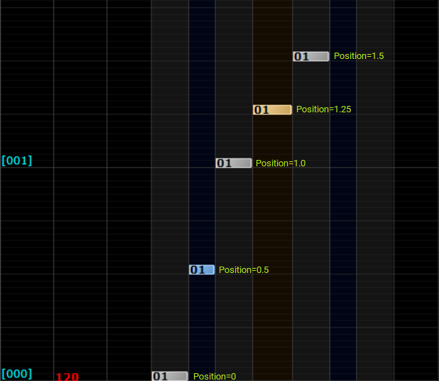

# Concept and Data Structures

The following guide outlines the concepts necessary to start working with RhythmCore.

## Chart

*Chart* (also known as *NoteChart*, *StepChart*, *BeatMap*, *Map*, and many others) represents a music header and collections of *events*.  

The [`IChart`](../Runtime/Scripts/Chart.cs) interface can be implemented to build your Chart structure and store essential song information you want to display and use during rendering.
When implementing `IChart`, you must implement the required methods and the `Bpm` property defined in the interface. Further details can be found in the code documentation.

Alternatively, much like the other parts of this package, an opinionated implementation of `IChart` is available, namely the `Chart` class. You can use it directly or implement it in your class.

## Event and Position

In RhythmCore, an *event* represents an element in your `Chart`. It could be a note, a background sound, a BPM change, simultaneous camera transformations, and many others.  

Each of these *events* possesses a property called `Position`, a single-floating value denoting the musical timing position independent from `BPM` and [Time Signature](https://en.wikipedia.org/wiki/Time_signature). 
The value starts from `0` and can be obtained by adding the measure and fractional position inside the measure on a scale of `0` to `1`.  

For example, `0` represents the beginning of the first measure, `0.5` represents halfway through the first measure, `1` represents the 2nd measure, `1.25` is the quarter of the 2nd measure, and so on.

<p align="center" style="text-align:center">
  <br/>
  <i><sup>Illustration of the notes positions</sup></i>
</p>

> [!Important]
> Changing [Time Signature](https://en.wikipedia.org/wiki/Time_signature) (e.g Changing a measure to 2/2 from 4/4) is currently not supported.  
> The example of this feature is a *Measure Fraction* in O2Jam in which a measure appears shorter than the standard measure.

## RhythmEvent

[`RhythmEvent`](../Runtime/Scripts/RhythmEvent.cs) is an abstract class representing the *event*. You can implement this class to describe your notes, tempo change, or other cool effects throughout the music. Aside from the `Position`, there are two essential properties of this class: 

- `ID`: A property to uniquely identify a `RhythmEvent` during the rendering process. The value must be unique; otherwise, the Chart may not be rendered correctly.
- `Instantiable`: A property determining whether your event is instantiable into a `UnityEngine.Object`. Events that will appear in your scene should always return `true`; Otherwise, events like BPM change have this value set to `false`.
- `Playable`: A property determining whether your event should be interactable with user input. For example, a note displayed in your scene is typically a playable event unless the user cannot interact with it.

These 2 properties will help you manage your events and Unity (Game)Objects when rendering a `Chart`. For example, with the `Instantiable` and `Non-Playable` combinations, 
you can implement a background sound note with Unity audio system that needs to be played without user interaction.  

You can do this by attaching the `AudioSource` to the GameObject that instantiated from the note event and disabling / omitting the Renderer components so it stays invisible to the user. 
There are many other ways to approach this problem. You can use any different approach that fits your needs.

There are 2 types of built-in events: `RhythmEvent.Note<T>` and `RhythmEvent.Tempo`:

- ### RhythmEvent.Note\<T\>

  An abstract class representing a musical note in your `Chart`. The type parameter is how you define `Channel` (known as *Lane*). The `Channel` doesn't have to be an enum. It could be anything if it is convertible to `Int32`, which is helpful if you plan to build a *Lane-less* rhythm game.
  
  An opinionated implementation is available at the non-generic version of `RhythmEvent.Note`, which uses the `RhythmCore.Channel` enum as the type parameter, representing 10 Playable Channels with an additional 1 Non-Playable Background Channel.

  The following code is an example of how you implement a simple *Long Note*

  ```csharp
  // Represents a simple Long Note in a Lane-less rhythm game
  public class LongNote : RhythmEvent.Note<int>
  {
      // Represents the length of the long note. The end position is relative to the start of the LongNote (LongNote.Position)
      public float Length { get; set; }

      // Helper method to calculate the end position
      public float End => Position + Length;
  }
  ```

- ### RhythmEvent.Tempo

  Represents a musical timing event. The framework provides 3 types of built-in time events: `BPM`, `Skip` and `Stop`.
  - `BPM`: The value of BPM Change
  - `Skip`: Advance renderer position by the specified value
  - `Stop`: Pause the rendering by the length of the specified value

  Both `Skip` and `Stop` are specified in position format and not in seconds. For example, `Skip = 1.5` will skip 1 and a half measures ahead from the current renderer position. Minus values are not supported.

  > [!Important]
  > When Implementing a custom tempo event, it is recommended to inherit the `RhythmEvent.Tempo` class so the `ChartRenderer.Tempo` can track any tempo changes throughout the rendering process.

## Adding events to your Chart

After defining the data structures you need, you start loading your chart into your game. The package doesn't tell you how to serialize or deserialize your data; you're free to choose!
Alternatively, you can hard code your events into the code, which is ideal for simple testing.

You can start adding the events by calling `AddEvents<T>()`:

```csharp
    class HyperCustomMap : Chart
    {
      public string NoteDesigner { get; set; }
    }
    
    enum MyGameLevelType
    {
        Beginner = 0,
        Master   = 1
    }
    
    //You can return your custom chart class instead if needed!
    IChart LoadChart()
    {
        IChart chart = new HyperCustomMap() { Bpm = 120f, NoteDesigner = 'Yours truly, me!' }; // load your chart here..
    
        // Generate 10 events
        RhythmEvent[] events = new RhythmEvents[10];
        for (int i = 0; i < events.Length; i++)
        {
            // Place a note every beat
            events[i] = new RhythmEvent.Note { Position = 0.25f * i };
        }
    
        // Add your events to the chart and associate it with `Difficulty.Easy`
        chart.AddEvents(Difficulty.Easy, events); 
    
        // Alternatively, you're free to use any other enum as your difficulty, for example:
        chart.AddEvents(MyGameLevelType.Master, events);
    
        return chart;
    }
```

Please look at the [ChartGenerator](../Samples~/Tempo/Scripts/ChartGenerator.cs) sample class for more complex examples of generating events via code.
