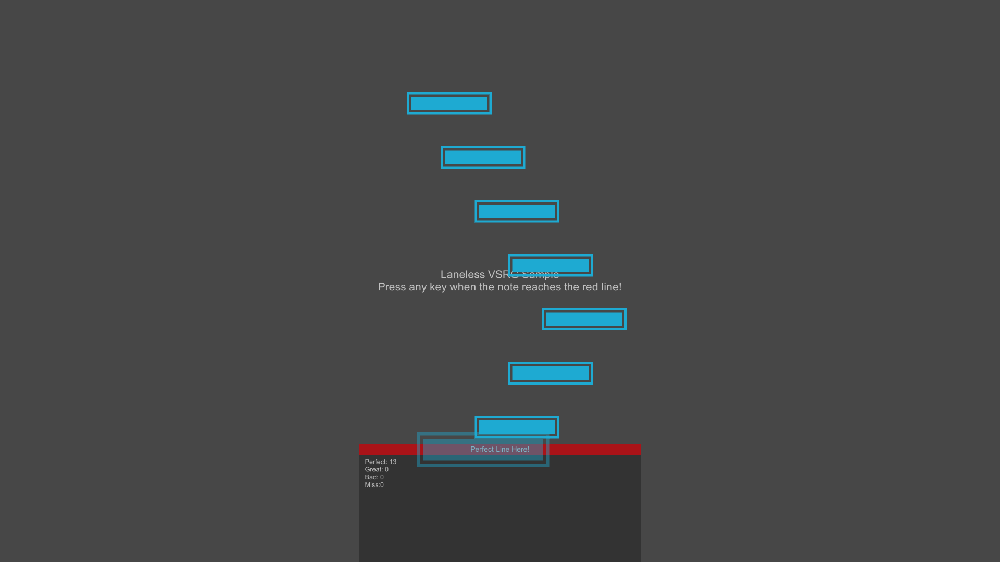

# RhythmCore

An opinionated micro-framework to bootstrap or prototype your next rhythm game in Unity.  

This Unity package offers an agnostic core implementation for a rhythm game with no dependencies, allowing you to develop a diverse range of 2D / 3D rhythm games with any sound engine, input system, serialization library, or any modules of your choice.  

Be it your classical VSRG (Vertical Scroll-based Rhythm Game) or venturing into a Non-Standard Rhythm Game, you can always start with Rhythm Core!

| |  |
|--------------------------|---------------------------|

# Installation

## Using git
1. Create or Open an existing Unity project.
2. Open the Unity Package Manager (UPM) from `Window -> Package Manager`.
3. Click Add Package (`+`) on the upper left corner and select `Add package from git URL`.
4. Enter `git@github.com:SirusDoma/RhythmCore.git` and click the `Add` button.
5. Done!

## Using asset package
1. Download the [unitypackage](../../releases/latest) file.
2. Create or Open an existing Unity project.
3. Select your `Assets` folder and then click `Assets -> Import Package -> Custom Package..`
4. Locate the downloaded `.unitypackage`.
5. Done!

# Documentation

Please refers to the [Documentation](Documentation~/README.md) for the development guide.

# Samples

A collection of fully working samples can be found in the [Samples](Samples~) folder.  

# License

This open-source software is licensed under the [zlib/png license](LICENSE.md).
